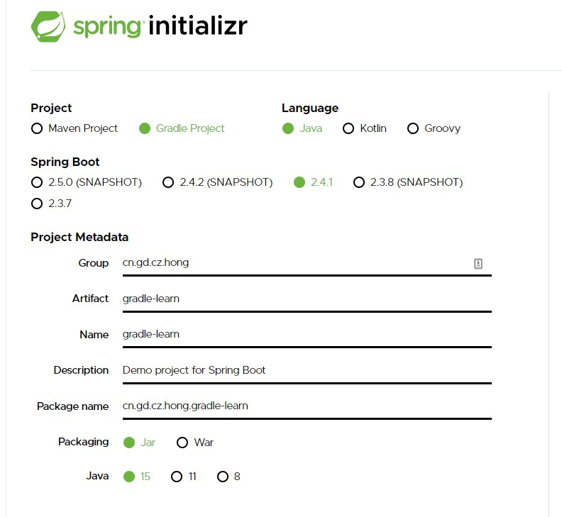

# gradle-learn
学习gradle的使用 以及 总结java中使用的坑

### 学习过程
#### 入门
##### 使用idea创建一个springboot+gradle项目
使用idea 创建一个gradle项目
修改 build.gradle 文件使之成为一个springboot项目

参考
- [IDEA+Gradle搭建Spring Boot项目图文教程](https://www.awaimai.com/2621.html)
##### 使用官网创建一个springboot+gradle项目
[srping initializr](https://start.spring.io/)
 
